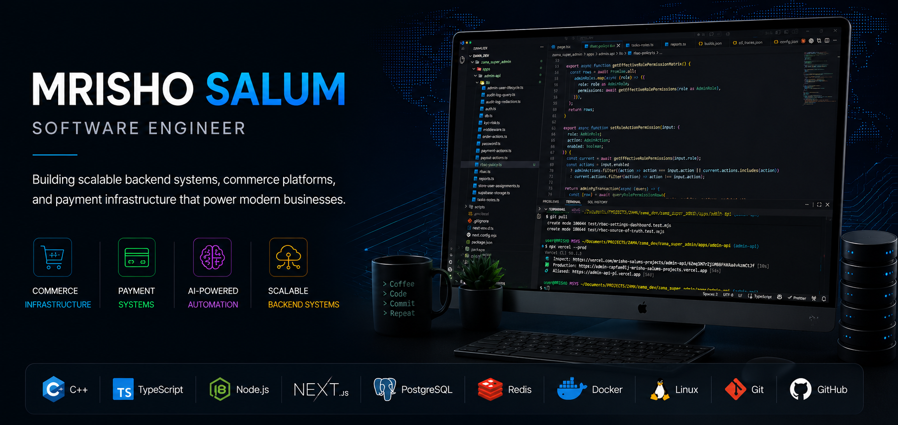

  

# Hi 👋 I'm **Mrisho Salum**

### Software Engineer building commerce infrastructure, payment systems, and AI-powered business platforms.

I enjoy building software that solves real-world business problems through scalable backend systems, modern software architecture, and continuous learning.

---

---

# About Me

I'm passionate about designing software that helps businesses operate more efficiently.

My engineering interests include:

* Backend Engineering
* Commerce Infrastructure
* Payment Systems
* AI-powered Business Automation
* Distributed Systems
* Modern C++
* Software Architecture

I believe the best software is built on strong engineering fundamentals—from memory management and networking to scalable distributed architectures.

---

# Featured Projects

## 🛍️ Zama Commerce Platform

A modern commerce platform designed to help businesses manage products, payments, customer communication, and AI-assisted workflows.

**Core Areas**

* Commerce operations
* Payment workflows
* WhatsApp integration
* AI-assisted business automation

---

## 💳 Payment Management System

Designed and developed a production payment management system supporting real business payment operations.

**Highlights**

* Production deployment
* Payment processing workflows
* Transaction management
* Business operations support

---

# Tech Stack

### Languages

* C++
* TypeScript
* JavaScript
* SQL

### Backend

* Node.js
* Next.js
* REST APIs

### Data

* PostgreSQL
* Redis
* Supabase

### Infrastructure

* Docker
* Git
* Linux

---

# 🎯 Current Focus

- 🏗️ Backend Engineering
- 🌐 Distributed Systems
- 💳 Payment Infrastructure
- 🤖 AI-Powered Business Automation
- 🖥️ Modern C++
- ⚡ Scalable System Design

---

# Engineering Philosophy

> **Build software that solves real business problems.**

I enjoy understanding how software works from the operating system to distributed production environments. Every project is an opportunity to improve reliability, scalability, and maintainability.

---

# GitHub Stats

  

---

# 📫 Contact

# 2026 Goals

* Build production-grade backend platforms
* Master Modern C++
* Deepen expertise in distributed systems
* Contribute to open source
* Continue improving software craftsmanship

---

### Thanks for visiting!

**Building software that powers modern commerce.**

